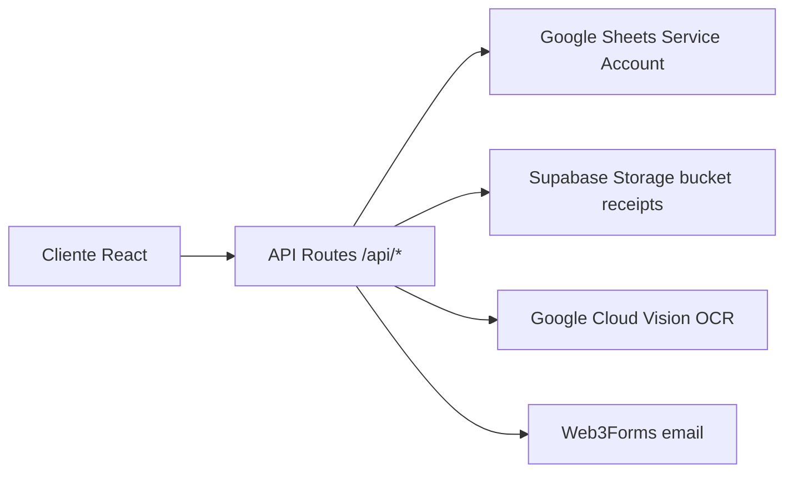

# CURRENT.md — GastosNX / GastosSII

> **Fuente de verdad del estado actual del proyecto.**
> Este documento debe mantenerse sincronizado con cualquier cambio estructural. Léelo antes de modificar código.

**Última actualización:** 2026-08-09

---

## 1. Resumen del proyecto

**GastosNX** (nombre interno de interfaz: **GastosSII**, versión `0.8.0`) es una aplicación web chilena para registrar, respaldar y categorizar **gastos operacionales menores** (peajes, estacionamientos, colaciones, combustibles, etc.) destinada a pymes y contadores en Chile.

Propósito principal: capturar el respaldo de un gasto antes de que se pierda, ordenarlo y dejarlo listo para la Declaración de Renta anual (compatible con requisitos SII). **No determina deducibilidad tributaria** — solo respaldo y orden documental.

**Marca / URL:** gastos.nxchile.com · Autor: NXChile · Contacto: gastos@nxchile.com

---

## 2. Stack tecnológico

| Área | Tecnología |
|------|-----------|
| Framework | **Next.js 16.2.4** (App Router) |
| UI / React | **React 19.2.4** |
| Lenguaje | TypeScript 5 (strict) |
| Estilos | Tailwind CSS 4 + PostCSS + autoprefixer |
| Íconos | lucide-react |
| Utilidades CSS | clsx + tailwind-merge (`cn`) |
| PWA | @ducanh2912/next-pwa + workbox-webpack-plugin |
| Google Sheets | googleapis (`google.sheets`) |
| Storage de imágenes | @supabase/supabase-js (bucket `receipts`) |
| OCR | **Google Cloud Vision API** (`/api/ocr`) |
| Envío de emails | Web3Forms (`api.web3forms.com/submit`) |

Scripts: `dev` (next dev) · `build` (next build) · `start` (next start) · `lint` (eslint).

---

## 3. Arquitectura general

> **Regla clave:** NO existe base de datos relacional propia. La **fuente de verdad de datos es Google Sheets**, vía Service Account. Supabase se usa **solo para almacenar imágenes** (no tablas de negocio).

Flujo de datos de alto nivel:



### Almacenamiento de datos (Google Sheets)

Existen **dos** Google Spreadsheets usados como base de datos:

1. **Hoja de Configuración/Usuarios** (`GOOGLE_CONFIG_SHEET_ID`):
   - Hoja **Usuarios** — columnas `A:J` (ver sección 6).
   - Hoja de empresas/maestra — columnas `A:E` para configuración por subdominio (leída por `lib/companyConfig.ts`).
2. **Spreadsheet de gastos por usuario** (`sheet_id_asociado` guardado en cada fila de Usuario):
   - Hoja **Gastos** — columnas `A:L` (ver sección 6).

Un **Spreadsheet maestro** (`GOOGLE_SHEET_ID_USERS`) contiene la hoja **Usuarios** para alta de registros/creación de usuarios.

---

## 4. Estructura de carpetas

```
src/
  app/
    └ (raíz) page.tsx ...         Landing pública (página de marketing)
    captura/page.tsx              Flujo de captura → OCR → revisión → guardado
    dashboard/page.tsx            Dashboard del usuario / empresa
    login/page.tsx                Login + modales recuperación/contacto
    manual/page.tsx               Manual de uso con video YouTube
    registro/
      page.tsx                    Selección de plan (Free/Pro/Enterprise)
      free/page.tsx               Registro plan Free
      pago/page.tsx               Registro plan de pago (Pro/Enterprise)
      confirmacion/{loading,page}.tsx
    admin/
      page.tsx                    Panel admin: gestión de usuarios
      generador-hash/page.tsx     Generador de hash de contraseñas
      reset-password/page.tsx     Reset de contraseña manual
    api/
      auth/route.ts               POST login (valida contra Usuarios sheets)
      expenses/route.ts           GET gastos (filtra por rol)
      save-expense/route.ts       POST guarda gasto + sube imagen + actualiza contador
      export/route.ts             GET CSV de gastos
      ocr/route.ts                POST Google Cloud Vision OCR
      get-company-config/route.ts GET config por subdominio
      health/route.ts             GET health check Supabase
      user/route.ts               (stub) GET Not implemented (501)
      admin/
        users/route.ts            CRUD usuarios (GET/POST/PUT/DELETE)
        stats/route.ts            GET estadísticas de empresa
        create-user-sheet/route.ts  Util: crea hoja Usuarios + admin por defecto
    layout.tsx                    Root layout (SEO, PWA, SupportButton)
    globals.css                   Estilos globales
  components/
    CameraCapture.tsx             Captura de foto/upload (blob)
    OcrProcessor.tsx              Overlay de progreso OCR
    ExpenseForm.tsx               Formulario de revisión/edición de gasto
    DashboardStats.tsx            (componente de stats)
    LoginForm.tsx                 (formulario login)
    SupportButton.tsx             Botón flotante de soporte
    ui/                           Button, Card, Input, Badge, Alert
  lib/
    auth.ts                       Sesión localStorage + hashPassword (SHA-256)
    storage.ts                    Subida/borrado imagen a Supabase Storage
    ocr.ts                        Cliente OCR → /api/ocr
    parser.ts                     Parser de boleta chilena (texto OCR → datos)
    companyConfig.ts              Lectura de config por subdominio
    sheets-users.ts               (vacío)
    password-utils.ts             Utilidades de password (generar/verificar)
    utils.ts                      cn() helpers
```

---

## 5. Autenticación y sesión

- El login delega en `/api/auth` (POST con `{ email, password }`).
- La contraseña se valida contra Google Sheets (comparando el hash SHA-256 almacenado).
- El tipo de sesión se guarda en **localStorage** bajo la clave `expense_tracker_session` (ver `lib/auth.ts`, tipo `UserSession`).
- Cualquier página protegida (dashboard, captura, admin) consulta `getSession()` y redirige a `/login` si no hay sesión activa.
- Las API Routes reciben la sesión en el **header** `x-session` (el JSON serializado de la sesión). **No hay JWT ni tokens** — la seguridad se basa en la sesión enviada por el cliente.
- Control de acceso admin: campo `rol === 'admin'` (normalizado con `.trim().toLowerCase()`).

Campos de la sesión (`UserSession`):
`email`, `empresa_nombre`, `plan`, `limite_boletas`, `boletas_usadas`, `activo`, `rol`, `sheet_id_asociado`.

---

## 6. Esquema de datos (Google Sheets)

### Hoja **Usuarios** (columnas `A:J`)
| Índice | Columna | Descripción |
|--------|---------|-------------|
| 0 | `email` | Email del usuario (único) |
| 1 | `password_hash` | Hash SHA-256 de la contraseña |
| 2 | `empresa_nombre` | Nombre de la empresa |
| 3 | `plan` | `free` / `pro` / `enterprise` |
| 4 | `limite_boletas` | Límite mensual de boletas |
| 5 | `boletas_usadas` | Contador mensual de boletas |
| 6 | `activo` | `TRUE` / `FALSE` |
| 7 | `rol` | `admin` / `user` |
| 8 | `creado_en` | Timestamp ISO de creación |
| 9 | `sheet_id_asociado` | Spreadsheet de gastos de la empresa |

### Hoja **Gastos** (columnas `A:L`)
| Índice | Columna | Descripción |
|--------|---------|-------------|
| 0 | `timestamp` | Timestamp ISO de registro |
| 1 | `fecha` | Fecha del gasto (YYYY-MM-DD) |
| 2 | `rut` | RUT del proveedor |
| 3 | `proveedor` | Nombre del proveedor |
| 4 | `monto` | Monto (numérico) |
| 5 | `categoria` | Categoría |
| 6 | `boleta_numero` | N° de boleta |
| 7 | `giro` | Giro del proveedor |
| 8 | `notas` | Notas adicionales |
| 9 | `ocr_confidence` | Confianza del OCR |
| 10 | `image_url` | URL pública de la imagen en Supabase |
| 11 | `creado_por` | Email del usuario que registró el gasto |

### Hoja de configuración de empresas (`GOOGLE_CONFIG_SHEET_ID`, `A:E`)
`email`, `sheetId`, `empresaNombre`, `subdomain`, `activo` (ver `lib/companyConfig.ts`).

---

## 7. Planes y límites

### Límites por plan
| Plan | Boletas/mes | Usuarios | Precio |
|------|-------------|----------|--------|
| `free` | 10 | 1 (self-registro) | $0 |
| `pro` | 500 | 2 | $9.900/mes (anual) o $12.900/mes |
| `enterprise` | 9999 (ilicamento) | 5 | $19.990/mes (anual) o $24.990/mes |

> Nota: en `api/admin/users/route.ts` los límites de usuarios por plan para creación son `free:1, pro:3, enterprise:10`, mientras el registro `pago` define `pro:2, enterprise:5`. **Existe una inconsistencia** entre estos valores que debe validarse con el negocio.

### Jerarquía de planes (admin)
`free (1) < pro (2) < enterprise (3)` — un admin solo puede crear/editar usuarios con planes iguales o inferiores al suyo (`PLAN_HIERARCHY`).

---

## 8. Flujo de captura de gasto

1. **Captura** (`/captura`): el usuario fotografía o sube una imagen (componente `CameraCapture`).
2. **OCR** (`/api/ocr`): la imagen se envía a **Google Cloud Vision** (`TEXT_DETECTION`), que devuelve el texto completo. Confianza fija en `95`.
3. **Parseo** (`lib/parser.ts`): `parseBoletaChilena(ocrText, confidence)` extrae fecha, RUT, proveedor, monto, giro y n° de boleta usando expresiones regulares.
4. **Revisión** (`ExpenseForm`): el usuario valida/edita los campos y selecciona categoría.
5. **Guardado** (`/api/save-expense`, POST multipart):
   - Sube la imagen a Supabase Storage (`receipts` bucket). **Si falla, igual guarda el gasto** (imagen opcional).
   - Valida límite de boletas (`boletas_usadas >= limite_boletas` → HTTP 403).
   - Append a la hoja `Gastos!A:L` del `sheet_id_asociado`.
   - Incrementa `boletas_usadas` en la hoja Usuarios.
   - Devuelve `boletas_usadas` actualizado para refrescar la sesión local.

---

## 9. API Routes (resumen funcional)

| Ruta | Método | Función |
|------|--------|---------|
| `/api/auth` | POST | Login, valida usuario y sesión |
| `/api/expenses` | GET | Lista gastos del usuario/empresa (filtra por rol admin/user) |
| `/api/save-expense` | POST | Guarda gasto + imagen + incrementa contador |
| `/api/export` | GET | Descarga CSV de gastos (filtra por rol) |
| `/api/ocr` | POST | OCR vía Google Cloud Vision |
| `/api/health` | GET | Health check de Supabase |
| `/api/get-company-config` | GET | Config por subdominio |
| `/api/user` | GET | **Stub** — retorna 501 Not implemented |
| `/api/admin/users` | GET/POST/PUT/DELETE | CRUD de usuarios (solo admin, filtrando por empresa) |
| `/api/admin/stats` | GET | Estadísticas de la empresa del admin |
| `/api/admin/create-user-sheet` | POST | Util: crea hoja `Usuarios` + admin por defecto |
| `/api/registro/free` | POST | Alta de registro plan Free en sheet |
| `/api/registro/pago` | POST | Alta de registro plan Pro/Enterprise en sheet |

---

## 10. Variables de entorno requeridas

Las variables indicadas se leen vía `process.env` en API Routes y cliente (`NEXT_PUBLIC_*`). Lista clave:

```
# Google Sheets (Service Account)
GOOGLE_SERVICE_ACCOUNT_EMAIL
GOOGLE_PRIVATE_KEY
GOOGLE_CREDENTIALS        (JSON completo, <-- usado por algunos endpoints)
GOOGLE_CONFIG_SHEET_ID
GOOGLE_SHEET_ID_USERS

# OCR
GOOGLE_VISION_API_KEY

# Supabase (Storage)
NEXT_PUBLIC_SUPABASE_URL
NEXT_PUBLIC_SUPABASE_ANON_KEY

# Emails (Web3Forms)
NEXT_PUBLIC_WEB3FORMS_KEY
```

> **⚠️ Inconsistencia de credenciales:** algunos endpoints usan `GOOGLE_SERVICE_ACCOUNT_EMAIL` + `GOOGLE_PRIVATE_KEY` (auth, expenses, save-expense, export, companyConfig), mientras otros usan `GOOGLE_CREDENTIALS` (admin/users, registro/free, registro/pago). Almacenar ambos en `.env.local`.

---

## 11. Observaciones / temas pendientes conocidos

> Las siguientes inconsistencias se encuentran **registradas como ADR en `docs/DECISIONS.md`**, ordenadas de mayor a menor importancia, cada una con sus pasos a corregir. Referencia cruzada del seguimiento: `DECISIONS.md` (ADR-001 a ADR-006).

| # | ADR | Tema pendiente | Urgencia |
|---|-----|----------------|----------|
| 1 | **ADR-001** | Estrategia de hashing de contraseñas inconsistente e insegura (SHA-256 plano vs. `algo:salt:hash`; password en texto plano vía email; admin default `admin123`) | 🔴 Crítica (seguridad) |
| 2 | **ADR-002** | Autenticación de sesión débil: header `x-session` + localStorage sin token/JWT (riesgo de escalada de privilegios) | 🔴 Alta (seguridad) |
| 3 | **ADR-003** | Límites de usuarios por plan inconsistentes entre `api/admin/users` y `registro/pago`, y vs. pricing público | 🟠 Media (negocio) |
| 4 | **ADR-004** | Doble sistema de credenciales de Google Sheets (`GOOGLE_SERVICE_ACCOUNT_EMAIL`/`GOOGLE_PRIVATE_KEY` vs `GOOGLE_CREDENTIALS`) y `getSheetsClient()` duplicado | 🟢 Media (mantenibilidad) |
| 5 | **ADR-005** | Confianza de OCR fija en 95 (Google Vision no entrega confianza en TEXT_DETECTION) — valor no fiable | 🟢 Baja (UX) |
| 6 | **ADR-006** | Código muerto / no usado: `api/user` (501), `lib/sheets-users.ts` vacío, `deleteReceiptImage` sin uso, assets de `layout.tsx` faltantes | 🟡 Baja (deuda técnica) |

Cada ADR en `DECISIONS.md` incluye el **contexto, la decisión pendiente, las alternativas y los pasos a corregir** detallados.

---

## 12. Convenciones de desarrollo

- Idioma de comunicación y UI: **Español (Chile)** (`es-CL`).
- Formato monetario: pesos chilenos CLP (`toLocaleString('es-CL')`).
- UI basada en componentes `ui/` (Button, Card, Input, Badge, Alert) con gradientes verdes/esmeralda (`emerald`/`teal`).
- Prefijos de `console.log` con emojis para debugging (`🔍`, `✅`, `❌`, `⚠️`).
- Alias de importación: `@/*` → `./src/*`.
- Sin librería de estado global; el estado se maneja con `useState`/`useEffect` y la sesión en localStorage.

---

## 13. Notas de mantenimiento

- **Al agregar/modificar API Routes, mantener la doc de esta sección (`§9`) sincronizada.**
- **Al cambiar columnas del schema, actualizar las tablas de la sección 6.**
- **Al cambiar variables de entorno requeridas, actualizar la sección 10.**
- Cualquier cambio estructural debe registrar una decisión en `DECISIONS.md`.