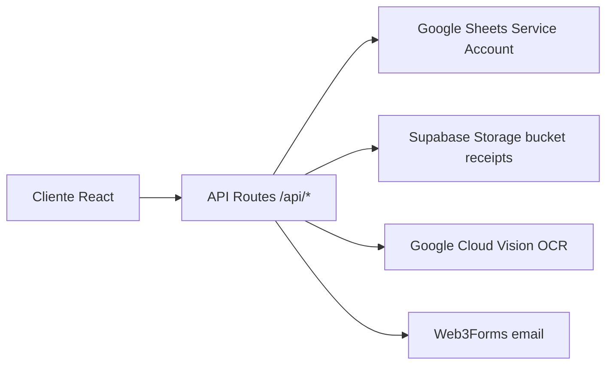

# CURRENT.md — GastosNX / RindeNX

> **Fuente de verdad del estado actual del proyecto.**
> Este documento debe mantenerse sincronizado con cualquier cambio estructural. Léelo antes de modificar código.

**Última actualización:** 2026-09-14

---

## 1. Resumen del proyecto

**GastosNX** (versión `1.0.0`) es una aplicación web chilena para registrar, respaldar y categorizar **gastos operacionales menores** (peajes, estacionamientos, colaciones, combustibles, etc.) destinada a pymes y contadores en Chile.

Propósito principal: capturar el respaldo de un gasto antes de que se pierda, ordenarlo y dejarlo listo para la Declaración de Renta anual (compatible con requisitos SII). **No determina deducibilidad tributaria** — solo respaldo y orden documental.

**Marca / URL:** gastos.nxchile.com · Autor: NXChile · Contacto: gastos@nxchile.com
> ℹ️ **Marca (2026-08-10):** la interfaz fue unificada de **"GastosSII"** → **"GastosNX"** (navbar, footers, textos y emails). El logotipo oficial es `public/images/LogogastosNX.png` (693×138, usado con `width={693}`/`height={138}` y clases `h-* w-auto object-contain`).

### RindeNX (sistema independiente, en desarrollo)

> ⚠️ **Coexistencia:** RindeNX es un **sistema independiente** que coexiste con GastosNX en el mismo repositorio. Ambos productos tienen dashboards separados, datos independientes y un **puente opcional** que permite aprovechar ciertos documentos de rendiciones en la línea de Gastos.

- **Subdominio:** `rinde.nxchile.com` (mismo deploy que `gastos.nxchile.com`, enrutado por `src/proxy.ts`). **Desplegado y verificado (2026-09-08):** dominio agregado en Vercel, DNS en Cloudflare (`CNAME rinde → expense-tracker-nxchile.vercel.app`) propagado y `COOKIE_DOMAIN=.nxchile.com` configurado. Detalles en `DEPLOY.md` §2.1.
- **Landing pública:** `src/app/rinde-landing/` (ruta `/rinde-landing`, pública sin auth; en `rinde.nxchile.com` es la raíz vía proxy). Paleta ámbar/naranja (RindeNX). Secciones: Hero+CTA demo, Prueba social (logos), "¿Tu empresa todavía funciona así?" (pain points), Cómo funciona (timeline 7 pasos), Demo visual (2 cards de fondo), Beneficios (fondo completo controlado), RindeNX+GastosNX (ecosistema), Testimonios (Antes→Resultado), CTA final (demo+WhatsApp). Contacto: `rinde@nxchile.com`.
- **Página de precios:** `src/app/precios/` (ruta `/precios`, pública sin auth). SEO optimizado (title, meta description, OG, structured data SoftwareApplication/Organization/FAQPage/BreadcrumbList). Selector mensual/anual, 4 planes (Pyme $9.900/$12.900, Empresa $19.900/$24.900, Pro $34.900/$44.900, +30 cotizar), flujos visuales (fondo→contabilidad, admin→rendidor→contabilidad, RindeNX→GastosNX), beneficios, sectores, FAQ 9 preguntas, CTA demo/WhatsApp.
- **SSO entre subdominios:** la cookie `gx_session` acepta `domain` vía la variable `COOKIE_DOMAIN` (p.ej. `.nxchile.com`). En localhost debe quedar vacía. Con el mismo deploy + `AUTH_SECRET`, login en un subdominio vale para ambos.
- **Funcionalidad:** Manejo de rendiciones de fondos fijos, gastos de personal, revisión/aprobación por admin, generación de asiento contable.
- **Asignación de fondos:** El admin asigna un monto + observación/glosa a un usuario, quien rinde contra ese fondo.
- **Puente (Fase 5):** RindeNX → GastosNX (dirección única). Solo aplica a empresas con `gastos_activo=TRUE` en la hoja `Config_Rinde` del spreadsheet.
- **Usuarios afectados por el puente:** solo `tipo_usuario: ambos` y empresas que también usan GastosNX.
- **NO comparte tablas con GastosNX:** cada cliente tiene su propio spreadsheet que contiene tanto la línea de Gastos como la de RindeNX.

---

## 2. Plan de 8 Fases del Proyecto

| # | Fase | Estado | Descripción |
|---|------|--------|-------------|
| 1 | Identificación de usuario | ✅ Completada | Campo `tipo_usuario` agregado a la hoja Users (columna K). Valores: `gastos`, `rinde`, `ambos`. |
| 2 | Dashboard super-admin con navegación | ✅ Completada | Autenticación contra Google Sheets, layout con navbar, logout, listado de fases. |
| 3 | Gestión de usuarios en la hoja Users | ✅ Completada | CRUD de usuarios desde el super-admin (`/super-admin/usuarios`) con filtros, modal de edición y modal de creación. |
| 4 | Gestión de empresas (hoja Config) | ✅ Completada | CRUD de empresas desde el super-admin (`/super-admin/empresas`) con validación de email/subdomain/sheet_id. |
| 5 | Puente GastosNX + RindeNX | ✅ Completada | Integración unidireccional RindeNX → GastosNX con selección manual de gastos al aprobar rendición. Solo `boleta` y `voucher` pasan (las `factura` no). |
| 6 | RindeNX - Fondos y asientos | ✅ Completada | Spreadsheet RindeNX con 7 hojas (Rendiciones, GastosRinde, Asientos, Puente, Fondos, Config_Rinde + Gastos), dashboard, rendiciones, gastos, aprobación, asiento contable. |
| 7 | RindeNX - Puente de documentos | ✅ Completada | Vista `/rinde/puente` con tabla de documentos traspasados, filtros y sección en detalle de rendición mostrando los gastos pasados. |
| 8 | Documentación y despliegue | ✅ Completada | Actualización de `CURRENT.md` y `DECISIONS.md`, guía de pruebas locales, guía de despliegue de `rinde.nxchile.com`. Despliegue verificado y funcionando (2026-09-08). |

### Cambios adicionales recientes (post-Fase 8)

- ✅ Hoja `Fondos` agregada (asignación de fondos por admin)
- ✅ Columna `tipo_documento` en `GastosRinde` (boleta/factura/voucher/sin_comprobante)
- ✅ Asiento contable separado por tipo (boletas vs facturas)
- ✅ Herencia de plan/boletas/empresa al crear usuarios desde el admin
- ✅ **Bug login corregido (2026-09-03):** la hoja Usuarios se leía solo hasta la columna J, por lo que `tipo_usuario` (columna K) nunca se cargaba en la sesión y todo usuario caía en `/dashboard`. Se amplió el rango a `Usuarios!A2:K100`, se agregó `tipo_usuario` al payload de sesión y a los tipos `SessionPayload`/`UserSession`. Ahora:
  - `rinde` → login redirige a `/rinde`
  - `ambos` → login redirige a GastosNX `/dashboard` y muestra botón **RindeNX** en el navbar (también redirige a `/rinde` si es `solo rinde`)
  - `gastos` → bloqueado de `/rinde` (layout redirige a `/dashboard`)
- ✅ Vinculación rendiciones ↔ fondos: `rendiciones` guardan `fondo_id` (col K), y al aprobar se descuenta el `monto_total` del saldo del fondo (`Fondos!D{row}`).
- ✅ Asignación de fondos filtra usuarios: solo se listan usuarios con `tipo_usuario` = `rinde` o `ambos` (se excluye `gastos`).
- ✅ Dashboard RindeNX rediseñado: diseño elegante (fondos neutros, stat cards arriba, pestañas **Fondos en Curso** / **Rendiciones**). Para usuarios no-admin se **oculta** el Puente de Documentos y se muestra flujo atado a un fondo único.
- ✅ OCR + Supabase en captura de gastos de RindeNX: `/rinde/rendiciones/[id]/nuevo-gasto` ahora tiene captura de imagen (`CameraCapture`), OCR con pre-relleno (`OcrProcessor` + `parseBoletaChilena`), vista previa y subida del comprobante a Supabase Storage. `/api/rinde/gastos` acepta `multipart/form-data` (imagen + datos), sube la imagen y guarda `image_url` (col K). El detalle de rendición muestra miniatura del comprobante.
- ✅ **Bugs corregidos (2026-09-03, sesión de revisión):**
  - **Listado de usuarios al asignar fondo:** `/api/admin/users` (GET) leía `Usuarios!A2:J` y nunca devolvía `tipo_usuario` (col K), por lo que la asignación de fondos no mostraba ningún usuario (filtro `rinde`/`ambos`). Ampliado a `Usuarios!A2:K`. El PUT ahora lee/escribe `A:K` y preserva `tipo_usuario`.
  - **Refresco de fondos/rendiciones:** los GET de `/api/rinde/fondos` y `/api/rinde/rendiciones` ejecutaban `ensureRindeStructure` (7+ llamadas a Google Sheets) en cada lectura, causando carga lenta. Se eliminó de los GET (la estructura ya se asegura en los POST/escrituras y al crear el spreadsheet). El GET de rendiciones ahora lee `A2:K` e incluye `fondo_id`.
  - **`rinde/page.tsx`:** forzaba `tipo_usuario: 'rinde'` hardcodeado; ahora usa el tipo real de la sesión (afecta a usuarios `ambos`).
- ✅ **Corrección de mapeo puente → hoja `Gastos` de GastosNX:** el POST `/api/rinde/puente` escribía solo 11 valores corridos en `Gastos!A:L` (A=fecha, ... K=creado_por, L vacío). Ahora escribe las 12 columnas en el MISMO orden que `/api/save-expense` y que lee `/api/expenses`: `A=timestamp`, `B=fecha`, `C=rut`, `D=proveedor`, `E=monto`, `F=categoria`, `G=boleta_numero`, `H=giro`, `I=notas`, `J=ocr_confidence`, `K=image_url`, `L=creado_por`. Así los gastos pasados por el puente calzan idénticos a los gastos nativos de GastosNX.
- ~~⏳ Pendiente: Vincular dashboard unificado para admin `ambos`~~
- ~~⏳ Pendiente: Actualización de `docs/PRUEBAS_LOCALES.md` con los nuevos flujos~~
- ✅ **Modelo "una rendición por fondo" (2026-09-03):** cada fondo tiene una única rendición en curso. Al presionar **"Rendir contra este Fondo"** se reutiliza la rendición `abierta` existente (o se crea con `monto_estimado` = saldo del fondo). El usuario rinde varias veces (OCR individual/masivo) agregando gastos a la misma rendición, y puede **sobre-render** (rinde más del fondo asignado).
- ✅ **Estados de rendición ampliados:** `terminada` (el usuario cierra su rendición, bloqueando edición) → el admin puede `abrir`/devolver, `aprobar`, `rechazar` o `pagar_saldo_favor` (cierra la rendición pagando el saldo a favor al usuario).
- ✅ **Asiento cuadrado (Debe = Haber):** rediseñado en `generateAsientoContable` para reflejar la diferencia rendido vs fondo asignado (saldo en contra/a favor). Usa cuentas configurables de `Config_Rinde!E:F`. Ver estructura en §6.
- ✅ **Bloqueo de gastos por estado:** POST `/api/rinde/gastos` ahora valida que la rendición esté `abierta` y pertenezca al/los usuarios con permiso; rechaza agregar gastos una vez `terminada`/`aprobada`/`cerrada`. El `monto_total` de la rendición (col E) se recalcula en vivo sumando **solo sus propios gastos**.
- ✅ **Diferencia frente al fondo (2026-09-03):** el GET `/api/rinde/rendiciones/[id]` devuelve el `fondo` asignado (monto + saldo); la tarjeta de resumen del detalle y el mensaje de saldo en contra comparan el total rendido contra el **fondo asignado** (no contra el monto_total de la rendición).
- ✅ **ADR-011 (2026-09-03):** unificación del modelo a "una rendición por fondo", estados ampliados (`terminada`, `pagar_saldo_favor`), bloqueo de gastos por estado/ownership, y **asiento cuadrado (Debe = Haber)** con cuentas configurables de `Config_Rinde!E:G` (supera el asiento de 3 líneas del ADR-010). Detalles en `DECISIONS.md` ADR-011.
- ✅ **Refuerzo del parser OCR compartido (2026-09-03):** `src/lib/parser.ts` (`parseBoletaChilena`) se fortaleció y aplica a **ambos** productos (GastosNX `/captura` y RindeNX `/nuevo-gasto`). Correcciones: se eliminó un **loop infinito** (regex RUT sin flag `g`) que colgaba el parseo; detección de **tipo de documento** (boleta/factura/voucher); **monto** en la línea siguiente a `TOTAL:`/`MONTO COMPRA`; **RUT del proveedor** acotado al bloque superior del documento (no confunde tokens de tarjeta) tolerando formatos deformados por OCR; **proveedor** por razón social (SA./SPA./LTDA.); validación de dígito verificador del RUT.
- ✅ **Landing pública RindeNX (2026-09-08):** nueva ruta pública `src/app/rinde-landing/page.tsx` (+ `layout.tsx` con metadata/OG propios) con Hero+CTA, "Cómo funciona" (3 pasos), Beneficios (6 cards), Prueba social (logos clientes NXChile) y Contacto (WhatsApp + `rinde@nxchile.com` + acceso). Paleta ámbar/naranja; CTA a `/login` compartido; sin registrar usuarios (acceso por admin).
- ✅ **Proxy de subdominios (2026-09-08):** `src/proxy.ts` (Next 16 renombró `middleware` → `proxy`). En `rinde.nxchile.com`: `/`→`/rinde-landing`, `/login`→compartido, `/rinde**`→pasa directo, resto→rewrite `/rinde/<ruta>`. Fuera del host `rinde.` no hace nada. Assets estáticos siempre pasan.
- ✅ **SSO cookie entre subdominios (2026-09-08):** `src/lib/session.ts` firma la cookie `gx_session` con `domain` optativo vía `COOKIE_DOMAIN` (debe ser `.nxchile.com` en producción). Mismo deploy + mismo `AUTH_SECRET` hacen que gastos./rinde. compartan sesión; en localhost la variable se deja vacía y el comportamiento no cambia.
- ✅ **Despliegue en producción verificado (2026-09-08):** `rinde.nxchile.com` resuelve al mismo deploy que `gastos.nxchile.com`, carga la landing RindeNX en `/`, el login compartido funciona y la app `/rinde` opera con normalidad. Fase 8 cerrada.
- ✅ **Avance de consumo en "Fondos en Curso" (2026-09-14):** las tarjetas de fondo del dashboard ahora muestran barra de progreso de **avance del consumo** (`consumido = monto_asignado − saldo`, con % coloreado por umbrales), el monto consumido "de $X", y para el admin un badge con la cantidad y monto de rendiciones **en trámite** (abierta/terminada/en_revision) atadas al fondo. Se agrega el helper `consumoFondo()` en `dashboard-client.tsx`.
- ✅ **429 Google Sheets mitigado en flujo aprobar+puente (2026-09-14):** se eliminó `ensureRindeStructure` (≈7 lecturas) de los GET y PATCH de `rendiciones/[id]`, del GET/POST de `puente`, y del PATCH/DELETE de `fondos/[id]` (la estructura solo se asegura en los POST/escrituras). Además se deduplicaron lecturas: el POST `/api/rinde/puente` ya no relee `GastosRinde` (recalcula totales desde la lectura inicial) ni `Fondos` (una sola lectura usada para asignado y descuento de saldo); el PATCH de rendiciones igual reusa una lectura única de `Fondos`. El ciclo aprobar+puente pasa de ~55 a ~18 lecturas.
- ✅ **Avance vs fondo incluye sobre-rendición (2026-09-14):** en las tarjetas de fondo del dashboard (admin y rendidor) el avance refleja lo **efectivamente rendido** (incluye rendiciones en trámite): "Rendido $X de $Y", porcentaje (puede superar 100%), "aprobado/descontado" y badge verde "Sobre-rendido +$Z — saldo a favor a reembolsar" cuando se rindió más que el fondo asignado (`consumoFondo()` en `dashboard-client.tsx`).
- ✅ **Tarjetas superiores con avance (2026-09-14):** "Saldo Disponible" muestra barra de avance con "Comprometido (aprobado + en trámite) $X (pct%)"; "Por Revisar / Abiertas" muestra "Por $X en rendiciones en curso"; "Rendiciones Aprobadas" muestra "Total contabilizado $X".
- ✅ **Asiento contable desplegado completo (2026-09-14):** el GET de rendición solo devolvía la primera línea del asiento (el id se escribía únicamente en la fila cabecera), mostrando Debe/Haber en 0 cuando la primera línea era de facturas vacías. Se corrige: el GET filtra por `rendicion_id` (col B) para recuperar **todas** las líneas del asiento, y los generadores (POST `/api/rinde/puente` y PATCH rendiciones) escriben `asiento.id` en **todas** las líneas. El asiento de la rendición ejemplo se despliega completo y cuadrado.
- ✅ **Aviso "Fondo consumido/sobre-rendido" al agregar gasto (2026-09-14):** en `/rinde/rendiciones/[id]/nuevo-gasto` se consulta el detalle de la rendición; si el fondo está en $0 o ya se rindió ≥ monto asignado, se muestra un banner (ámbar si alcanzó el límite, verde si ya está sobre-rendido) indicando que igual puede registrar el gasto porque la sobre-rendición está permitida y el excedente se liquidará como saldo a favor al aprobar.
- ✅ **Detalle de rendición por rol (2026-09-14):** el rendidor ve solo lo que rindió (resumen, gastos y acciones de su rendición); la sección **Asiento Contable**, los **Documentos enviados a GastosNX (puente)** y la columna "Pasado a Gastos" quedan visibles únicamente para admins en `/rinde/rendiciones/[id]`.
- ✅ **Landing RindeNX — upgrades para campaña comercial (2026-09-14):** rediseño completo de `src/app/rinde-landing/page.tsx` para campañas de publicidad. Cambios: (1) CTA unificado a **"Solicitar demostración"** (→ WhatsApp) en hero, admin section, sticky mobile y CTA final; (2) nuevo subtítulo de posicionamiento en hero; (3) nueva sección **"¿Tu empresa todavía funciona así?"** con 7 pain points; (4) **timeline de 7 pasos** (reemplaza 3 cards con imágenes); (5) nueva sección **demo visual** con 2 cards de fondo (en revisión $800k / aprobada $300k); (6) beneficios reformulados: "El fondo completo controlado de principio a fin"; (7) nueva sección **RindeNX + GastosNX** (ecosistema con diagrama); (8) **testimonios placeholder** con estructura Antes→Resultado (AC, RCC, San Andrés); (9) imports limpiados (`Clock` eliminado).
- ✅ **Página de precios RindeNX (2026-09-14):** nueva ruta `/precios` (`src/app/precios/page.tsx` + `precios-client.tsx`). SEO completo (title, meta description, OG, structured data SoftwareApplication/Organization/FAQPage/BreadcrumbList, canonical, index/follow). Selector mensual/anual con toggle real de precios, 4 planes (Pyme $9.900/$12.900 con tag "PARA COMENZAR", Empresa $19.900/$24.900, Pro $34.900/$44.900, +30 cotizar). Copy: "Precio preferente con pago anual". Flujos visuales verticales con valores demo (fondo→contabilidad, admin→rendidor→contabilidad, RindeNX→GastosNX→Contabilidad). Beneficios, sectores, FAQ 9 preguntas (contenido en DOM para SEO), CTA demo/WhatsApp. Analytics: BillingToggle, PlanClick. Responsive mobile-first. Proxy `/precios` agregado en `src/proxy.ts`.
- ✅ **Landing → Precios linkage (2026-09-14):** la landing RindeNX ahora enlaza a `/precios` en 4 puntos: navbar ("Planes y precios"), hero CTA secundario ("Ver planes y precios"), CTA final ("Ver planes y precios") y footer (sección Producto).

---

## 3. Estructura de carpetas de RindeNX

```
src/
  app/
    rinde/                                  # Módulo RindeNX
      layout.tsx                            # Auth guard
      page.tsx                              # Dashboard de RindeNX
      dashboard-client.tsx                  # UI dashboard
      puente/
        page.tsx                            # Vista de documentos del puente
        puente-client.tsx                   # UI de documentos traspasados
      fondos/
        page.tsx                            # Asignación de fondos
        fondos-client.tsx                   # UI de fondos
      rendiciones/
        [id]/
          page.tsx                          # Detalle de rendición
          detalle-client.tsx                # UI detalle + acciones + modal puente
          nuevo-gasto/
            page.tsx                        # Form nuevo gasto
            nuevo-gasto-client.tsx          # UI formulario
    rinde-landing/                          # Landing pública RindeNX (sin auth)
      page.tsx                              # Landing (Hero+CTA, Cómo funciona, Beneficios, Prueba social+contacto)
      layout.tsx                            # Metadata/OG propios de la landing
    precios/                                # Página de precios RindeNX (sin auth)
      page.tsx                              # Server component (SEO, structured data)
      precios-client.tsx                    # Client component (selector, planes, FAQ)
    api/
      rinde/
        rendiciones/
          route.ts                          # GET/POST rendiciones
          [id]/
            route.ts                        # GET/PATCH rendición
        gastos/
          route.ts                          # POST gastos (con tipo_documento)
        puente/
          route.ts                          # GET/POST puente
          documentos/
            route.ts                        # GET documentos del puente
        fondos/
          route.ts                          # GET/POST fondos
          [id]/
            route.ts                        # PATCH/DELETE fondo
  lib/
    rinde-helpers.ts                        # Helpers RindeNX (spreadsheetId, asientos, Fondos)
  proxy.ts                                  # Proxy de subdominios: rinde.* → RindeNX (Next 16)
```

---

## 6. Esquema de datos (Google Sheets)

### Hoja **Usuarios** (columnas `A:K`)
| Índice | Columna | Descripción |
|--------|---------|-------------|
| 0 | `email` | Email del usuario (único) |
| 1 | `password_hash` | Hash SHA-256 de la contraseña |
| 2 | `empresa_nombre` | Nombre de la empresa |
| 3 | `plan` | `free` / `pro` / `enterprise` |
| 4 | `limite_boletas` | Límite mensual de boletas |
| 5 | `boletas_usadas` | Contador mensual de boletas |
| 6 | `activo` | `TRUE` / `FALSE` |
| 7 | `rol` | `admin` / `user` / `superadmin` |
| 8 | `creado_en` | Timestamp ISO de creación |
| 9 | `sheet_id_asociado` | Spreadsheet de la empresa (contiene Gastos y Rinde) |
| 10 | `tipo_usuario` | `gastos` / `rinde` / `ambos` (Fase 1) |

### Hoja **Gastos** (columnas `A:L`) — para GastosNX
| Índice | Columna | Descripción |
|--------|---------|-------------|
| 0 | `timestamp` | Timestamp ISO de registro |
| 1 | `fecha` | Fecha del gasto (YYYY-MM-DD) |
| 2 | `rut` | RUT del proveedor |
| 3 | `proveedor` | Nombre del proveedor |
| 4 | `monto` | Monto (numérico) |
| 5 | `categoria` | Categoría |
| 6 | `boleta_numero` | N° de boleta |
| 7 | `giro` | Giro del proveedor |
| 8 | `notas` | Notas adicionales |
| 9 | `ocr_confidence` | Confianza del OCR |
| 10 | `image_url` | URL pública de la imagen en Supabase |
| 11 | `creado_por` | Email del usuario que registró el gasto |

### Hojas de RindeNX (en el mismo spreadsheet que Gastos)

#### `Rendiciones` (columnas `A:K`)
| Índice | Columna | Descripción |
|--------|---------|-------------|
| 0 | `id` | ID único de la rendición |
| 1 | `fecha_creacion` | ISO timestamp |
| 2 | `fecha_cierre` | ISO timestamp de cierre |
| 3 | `estado` | `abierta` / `terminada` / `en_revision` / `aprobada` / `rechazada` / `cerrada` |
| 4 | `monto_total` | Monto total de la rendición |
| 5 | `descripcion` | Descripción |
| 6 | `usuario_email` | Email del usuario que creó la rendición |
| 7 | `aprobado_por` | Email del admin que aprobó |
| 8 | `comentarios` | Comentarios del admin |
| 9 | `asiento_id` | ID del asiento contable |
| 10 | `fondo_id` | ID del fondo asignado (pendiente de UI) |

#### `GastosRinde` (columnas `A:O`)
| Índice | Columna | Descripción |
|--------|---------|-------------|
| 0 | `id` | ID único del gasto |
| 1 | `rendicion_id` | ID de la rendición padre |
| 2 | `fecha` | Fecha del gasto |
| 3 | `rut` | RUT del proveedor |
| 4 | `proveedor` | Nombre del proveedor |
| 5 | `monto` | Monto numérico |
| 6 | `categoria` | Categoría |
| 7 | `boleta_numero` | Número de boleta/factura |
| 8 | `giro` | Giro del proveedor |
| 9 | `notas` | Notas |
| 10 | `image_url` | URL de la imagen |
| 11 | `creado_por` | Email del usuario |
| 12 | `creado_en` | ISO timestamp |
| 13 | `pasado_a_gastos` | `TRUE` / `FALSE` |
| 14 | `tipo_documento` | `boleta` / `factura` / `voucher` / `sin_comprobante` |

#### `Asientos` (columnas `A:J`)
| Índice | Columna | Descripción |
|--------|---------|-------------|
| 0 | `id` | ID del asiento |
| 1 | `rendicion_id` | ID de la rendición |
| 2 | `fecha` | Fecha del asiento |
| 3 | `tipo` | Tipo de asiento (`rendicion`) |
| 4 | `cuenta` | Cuenta contable |
| 5 | `debe` | Monto en debe |
| 6 | `haber` | Monto en haber |
| 7 | `descripcion` | Descripción del asiento |
| 8 | `creado_por` | Email del admin |
| 9 | `creado_en` | ISO timestamp |

**Estructura del asiento (cuadrado, registro operacional que refleja la diferencia):**
- `Gastos operacionales – Facturas` → Débito (total facturas)
- `Gastos operacionales – Boletas/Vouchers` → Débito (total boletas + vouchers)
- Si rindió **menos** que el fondo: `Saldo por devolver del usuario` → Débito (diferencia)
- `Fondo por rendir – Cuenta por cobrar empleados` → Haber (monto asignado del fondo)
- Si rindió **más** que el fondo: `Saldo a favor del usuario – Reembolso` → Haber (diferencia)

El asiento **cuadra siempre** (Debe = Haber = monto asignado del fondo o total rendido). `cuenta_anticipo`, `cuenta_saldo_favor` y `cuenta_saldo_contra` son configurables en `Config_Rinde!E:G`. La app es un **registro operacional**, no un sistema contable: el contador usa este asiento como respaldo. Se descarga en **CSV / PDF (print)** y se comparte por **correo o WhatsApp**.

#### `Puente` (columnas `A:F`)
| Índice | Columna | Descripción |
|--------|---------|-------------|
| 0 | `id` | ID único del registro |
| 1 | `rinde_gasto_id` | ID del gasto en GastosRinde |
| 2 | `rendicion_id` | ID de la rendición |
| 3 | `gastos_row_number` | Fila donde se insertó en hoja Gastos |
| 4 | `pasado_en` | ISO timestamp del traspaso |
| 5 | `aprobado_por` | Email del admin |

**Nota:** Solo se registran traspasos de gastos con `tipo_documento` = `boleta` o `voucher`. Las facturas NO pasan al puente.

#### `Fondos` (columnas `A:I`)
| Índice | Columna | Descripción |
|--------|---------|-------------|
| 0 | `id` | ID único del fondo |
| 1 | `usuario_email` | Email del usuario asignado |
| 2 | `monto_asignado` | Monto original asignado |
| 3 | `saldo` | Saldo actual (se descuenta al aprobar rendiciones) |
| 4 | `observacion` | Glosa/observación del fondo |
| 5 | `fecha_asignacion` | ISO timestamp |
| 6 | `estado` | `en_curso` / `cerrado` |
| 7 | `asignado_por` | Email del admin que asignó |
| 8 | `empresa` | Nombre de la empresa |

#### `Config_Rinde` (columnas `A:G`)
| Índice | Columna | Descripción |
|--------|---------|-------------|
| 0 | `empresa` | Nombre de la empresa |
| 1 | `rinde_activo` | `TRUE` / `FALSE` |
| 2 | `gastos_activo` | `TRUE` / `FALSE` (controla el puente) |
| 3 | `admin_email` | Email del admin |
| 4 | `cuenta_anticipo` | Nombre de la cuenta anticipo (ej. "Fondo por rendir – Cuenta por cobrar empleados") |
| 5 | `cuenta_saldo_favor` | Cuenta para saldo a favor (ej. "Saldo a favor del usuario – Reembolso") |
| 6 | `cuenta_saldo_contra` | Cuenta para saldo en contra (ej. "Saldo por devolver del usuario") |

### Hoja de configuración de empresas (`GOOGLE_CONFIG_SHEET_ID`, `A:E`)
`email`, `sheetId`, `empresaNombre`, `subdomain`, `activo` (ver `lib/companyConfig.ts`).

---

## 2. Stack tecnológico

| Área | Tecnología |
|------|-----------|
| Framework | **Next.js 16.2.4** (App Router) |
| UI / React | **React 19.2.4** |
| Lenguaje | TypeScript 5 (strict) |
| Estilos | Tailwind CSS 4 + PostCSS + autoprefixer |
| Íconos | lucide-react |
| Utilidades CSS | clsx + tailwind-merge (`cn`) |
| PWA | @ducanh2912/next-pwa + workbox-webpack-plugin |
| Google Sheets | googleapis (`google.sheets`) |
| Storage de imágenes | @supabase/supabase-js (bucket `receipts`) |
| OCR | **Google Cloud Vision API** (`/api/ocr`) |
| Envío de emails | Web3Forms (`api.web3forms.com/submit`) |

Scripts: `dev` (next dev) · `build` (next build) · `start` (next start) · `lint` (eslint).

---

## 3. Arquitectura general

> **Regla clave:** NO existe base de datos relacional propia. La **fuente de verdad de datos es Google Sheets**, vía Service Account. Supabase se usa **solo para almacenar imágenes** (no tablas de negocio).

Flujo de datos de alto nivel:



### Almacenamiento de datos (Google Sheets)

Existen **dos** Google Spreadsheets usados como base de datos:

1. **Hoja de Configuración/Usuarios** (`GOOGLE_CONFIG_SHEET_ID`):
   - Hoja **Usuarios** — columnas `A:J` (ver sección 6).
   - Hoja de empresas/maestra — columnas `A:E` para configuración por subdominio (leída por `lib/companyConfig.ts`).
2. **Spreadsheet de gastos por usuario** (`sheet_id_asociado` guardado en cada fila de Usuario):
   - Hoja **Gastos** — columnas `A:L` (ver sección 6).

Un **Spreadsheet maestro** (`GOOGLE_SHEET_ID_USERS`) contiene la hoja **Usuarios** para alta de registros/creación de usuarios.

---

## 4. Estructura de carpetas

```
src/
  app/
    └ (raíz) page.tsx ...         Landing pública GastosNX (página de marketing)
    rinde-landing/
      page.tsx ...                 Landing pública RindeNX (ámbar; ruta /rinde-landing)
      layout.tsx ...               Metadata/OG propios de la landing RindeNX
    captura/page.tsx              Flujo de captura → OCR → revisión → guardado
    dashboard/page.tsx            Dashboard del usuario / empresa (stats + lista gastos + desglose por categoría)
    login/page.tsx                Login + modales recuperación/contacto
    manual/page.tsx               Manual de uso con video YouTube
    registro/
      page.tsx                    Selección de plan (Free/Pro)
      free/page.tsx               Registro plan Free
      pago/page.tsx               Registro plan de pago (Pro/Enterprise)
      confirmacion/{loading,page}.tsx
    admin/
      page.tsx                    Panel admin: gestión de usuarios
      generador-hash/page.tsx     Generador de hash de contraseñas
      reset-password/page.tsx     Reset de contraseña manual
    api/
      auth/route.ts            POST login (valida contra Usuarios sheets)
      auth/me/route.ts         GET sesión validada desde cookie httpOnly (ADR-002)
      auth/logout/route.ts     POST logout (borra cookie de sesión)
      expenses/route.ts        GET gastos (filtra por rol)
      save-expense/route.ts       POST guarda gasto + sube imagen + actualiza contador
      export/route.ts             GET CSV de gastos
      ocr/route.ts                POST Google Cloud Vision OCR
      get-company-config/route.ts GET config por subdominio
      health/route.ts             GET health check Supabase
      user/route.ts               (stub) GET Not implemented (501)
      admin/
        users/route.ts            CRUD usuarios (GET/POST/PUT/DELETE)
        stats/route.ts            GET estadísticas de empresa
        create-user-sheet/route.ts  Util: crea hoja Usuarios + admin por defecto
    layout.tsx                    Root layout (SEO, PWA, SupportButton)
    globals.css                   Estilos globales
  proxy.ts                        Proxy de subdominios: rinde.* → RindeNX (Next 16)
  components/
    CameraCapture.tsx             Captura de foto/upload (blob)
    OcrProcessor.tsx              Overlay de progreso OCR
    ExpenseForm.tsx               Formulario de revisión/edición de gasto
    DashboardStats.tsx            (componente de stats)
    LoginForm.tsx                 (formulario login)
    SupportButton.tsx             Botón flotante de soporte
    ui/                           Button, Card, Input, Badge, Alert
  lib/
    auth.ts                       Cliente sesión (loadSession/getSession) + hashPassword (SHA-256)
    session.ts                    Sesión JWT HS256 + cookie httpOnly (ADR-002)
    storage.ts                    Subida/borrado imagen a Supabase Storage
    ocr.ts                        Cliente OCR → /api/ocr
    parser.ts                     Parser de boleta chilena (texto OCR → datos)
    companyConfig.ts              Lectura de config por subdominio
    sheets-users.ts               (vacío)
    password-utils.ts             Utilidades de password (generar/verificar)
    utils.ts                      cn() helpers
```

---

## 5. Autenticación y sesión

- El login delega en `/api/auth` (POST con `{ email, password }`).
- La contraseña se valida contra Google Sheets (comparando el hash SHA-256 almacenado).
- **Sesión (ADR-002, resuelto):** al validar, el servidor **firma un JWT HS256** (con `AUTH_SECRET`) y lo envía como **cookie httpOnly** (`gx_session`). La sesión ya **no** se guarda en `localStorage` ni viaja por el header `x-session`.
- El cliente (`lib/auth.ts`) usa `loadSession()` para consultar `/api/auth/me` (lee la cookie) y cachea en memoria con `getSession()`. `logout()` llama a `/api/auth/logout`.
- Cualquier página protegida (dashboard, captura, admin) llama a `loadSession()` al montar y redirige a `/login` si no hay sesión activa.
- Las API Routes protegidas obtienen la sesión validada con `readSession(request)` (leen y verifican la cookie). **No confían en datos enviados por el cliente** (rol, sheet_id, límites).
- Control de acceso admin: campo `rol === 'admin'` (normalizado con `.trim().toLowerCase()` en el token).

Campos de la sesión (`UserSession`):
`email`, `empresa_nombre`, `plan`, `limite_boletas`, `boletas_usadas`, `activo`, `rol`, `sheet_id_asociado`.

---

## 6. Esquema de datos (Google Sheets)

### Hoja **Usuarios** (columnas `A:K`)
| Índice | Columna | Descripción |
|--------|---------|-------------|
| 0 | `email` | Email del usuario (único) |
| 1 | `password_hash` | Hash SHA-256 de la contraseña |
| 2 | `empresa_nombre` | Nombre de la empresa |
| 3 | `plan` | `free` / `pro` / `enterprise` |
| 4 | `limite_boletas` | Límite mensual de boletas |
| 5 | `boletas_usadas` | Contador mensual de boletas |
| 6 | `activo` | `TRUE` / `FALSE` |
| 7 | `rol` | `admin` / `user` / `superadmin` |
| 8 | `creado_en` | Timestamp ISO de creación |
| 9 | `sheet_id_asociado` | Spreadsheet de gastos de la empresa |
| 10 | `tipo_usuario` | Producto: `gastos` / `rinde` / `ambos` (Fase 1) |

### Hoja **Gastos** (columnas `A:L`)
| Índice | Columna | Descripción |
|--------|---------|-------------|
| 0 | `timestamp` | Timestamp ISO de registro |
| 1 | `fecha` | Fecha del gasto (YYYY-MM-DD) |
| 2 | `rut` | RUT del proveedor |
| 3 | `proveedor` | Nombre del proveedor |
| 4 | `monto` | Monto (numérico) |
| 5 | `categoria` | Categoría |
| 6 | `boleta_numero` | N° de boleta |
| 7 | `giro` | Giro del proveedor |
| 8 | `notas` | Notas adicionales |
| 9 | `ocr_confidence` | Confianza del OCR |
| 10 | `image_url` | URL pública de la imagen en Supabase |
| 11 | `creado_por` | Email del usuario que registró el gasto |

### Hoja de configuración de empresas (`GOOGLE_CONFIG_SHEET_ID`, `A:E`)
`email`, `sheetId`, `empresaNombre`, `subdomain`, `activo` (ver `lib/companyConfig.ts`).

---

## 7. Planes y límites

### Oferta pública vigente (2026-08-28)

#### Plan Free
- **$0 / mes**
- 1 usuario (self-registro)
- 10 boletas / mes
- OCR con Google AI
- Dashboard básico + Export CSV

#### Plan Pro — Pago anual (recomendado)
- **$3.300 por usuario / mes** (IVA incluido)
- Incluye hasta **3 usuarios** → **$9.900 / mes** total
- Usuario adicional (sobre los 3 de base): **$2.500 c/u**
- Facturación anual
- 500 boletas / mes
- OCR con Google AI
- Dashboard avanzado
- Export CSV + Excel
- Soporte prioritario

#### Plan Pro — Pago mes a mes
- **$4.000 por usuario / mes** (IVA incluido)
- Incluye hasta **3 usuarios** → **$12.000 / mes** total
- Usuario adicional (sobre los 3 de base): **$3.000 c/u**
- Sin contrato
- 500 boletas / mes
- Mismas características que el Pro anual

> ℹ️ **Enterprise eliminado (2026-08-28):** el plan Enterprise fue removido de la oferta pública y de los flujos de registro (`/registro`, `/registro/pago`, `/registro/confirmacion`). Permanece `enterprise` solo en el schema interno (`PLAN_LIMITS`, `PLAN_HIERARCHY`) por si fuera necesario a futuro, pero **ya no se ofrece, no se muestra en la UI pública y no se puede seleccionar en el registro**.
>
> ✅ **ADR-003 (2026-08-28):** **Resuelto**. Se unificó la fuente de verdad de límites por plan: `PLAN_LIMITS` en `src/app/api/admin/users/route.ts` y `src/app/admin/page.tsx`. Se alineó toda la UI pública (landing, `/registro`, `/registro/pago`, `/registro/confirmacion`) con la nueva estructura de precios por usuario. El admin hereda el plan al crear usuarios y el límite de boletas siempre viene de la constante del plan (no del cliente). Detalles completos en `DECISIONS.md` ADR-003.

### Jerarquía de planes (admin)
`free (1) < pro (2) < enterprise (3)` — un admin solo puede crear/editar usuarios con planes iguales o inferiores al suyo (`PLAN_HIERARCHY`).

### Constantes centralizadas

| Archivo | Constante | Valores |
|---------|-----------|---------|
| `src/app/api/admin/users/route.ts` | `PLAN_LIMITS` | `{ free: { boletas: 10, usuarios: 1 }, pro: { boletas: 500, usuarios: 3 }, enterprise: { boletas: 9999, usuarios: 10 } }` |
| `src/app/api/admin/users/route.ts` | `PLAN_HIERARCHY` | `{ free: 1, pro: 2, enterprise: 3 }` |
| `src/app/admin/page.tsx` | `PLAN_LIMITS` (frontend) | `{ free: 10, pro: 500, enterprise: 9999 }` |
| `src/app/registro/pago/page.tsx` | `planes.pro` | Precios por usuario (anual $3.300, mensual $4.000) y extras ($2.500 / $3.000) |

---

## 8. Flujo de captura de gasto

1. **Captura** (`/captura`): el usuario fotografía o sube una imagen (componente `CameraCapture`).
2. **OCR** (`/api/ocr`): la imagen se envía a **Google Cloud Vision** (`TEXT_DETECTION`), que devuelve el texto completo. Confianza fija en `95`.
3. **Parseo** (`lib/parser.ts`): `parseBoletaChilena(ocrText, confidence)` extrae fecha, RUT, proveedor, monto, giro y n° de boleta usando expresiones regulares. **Compartido por GastosNX (`/captura`) y RindeNX (`/rinde/.../nuevo-gasto`)**: aplica la misma lógica robusta a ambos. El parser detecta boleta/factura/voucher (`tipoDocumento`, usado por RindeNX), captura el **monto** en la línea siguiente a `TOTAL:`/`MONTO COMPRA` (típico de vouchers), busca el **RUT del proveedor** en el bloque superior del documento (evitando tokens de tarjeta) tolerando formatos deformados por OCR, y prioriza **razón social** del proveedor (SA., SPA., LTDA.). Incluye la restricción del dígito verificador del RUT.
4. **Revisión** (`ExpenseForm`): el usuario valida/edita los campos y selecciona categoría.
5. **Guardado** (`/api/save-expense`, POST multipart):
   - Sube la imagen a Supabase Storage (`receipts` bucket). **Si falla, igual guarda el gasto** (imagen opcional).
   - Valida límite de boletas (`boletas_usadas >= limite_boletas` → HTTP 403).
   - Append a la hoja `Gastos!A:L` del `sheet_id_asociado`.
   - Incrementa `boletas_usadas` en la hoja Usuarios.
   - Devuelve `boletas_usadas` actualizado para refrescar la sesión local.

---

## 9. API Routes (resumen funcional)

| Ruta | Método | Función |
|------|--------|---------|
| `/api/auth` | POST | Login, valida usuario y setea cookie httpOnly (ADR-002) |
| `/api/auth/me` | GET | Devuelve la sesión validada desde la cookie |
| `/api/auth/logout` | POST | Borra la cookie de sesión |
| `/api/expenses` | GET | Lista gastos del usuario/empresa (filtra por rol admin/user) |
| `/api/save-expense` | POST | Guarda gasto + imagen + incrementa contador |
| `/api/export` | GET | Descarga CSV de gastos (filtra por rol) |
| `/api/ocr` | POST | OCR vía Google Cloud Vision |
| `/api/health` | GET | Health check de Supabase |
| `/api/get-company-config` | GET | Config por subdominio |
| `/api/user` | GET | **Stub** — retorna 501 Not implemented |
| `/api/admin/users` | GET/POST/PUT/DELETE | CRUD de usuarios (solo admin, filtrando por empresa) |
| `/api/admin/stats` | GET | Estadísticas de la empresa del admin |
| `/api/admin/create-user-sheet` | POST | Util: crea hoja `Usuarios` + admin por defecto |
| `/api/registro/free` | POST | Alta de registro plan Free en sheet |
| `/api/registro/pago` | POST | Alta de registro plan Pro/Enterprise en sheet |

---

## 10. Variables de entorno requeridas

Las variables indicadas se leen vía `process.env` en API Routes y cliente (`NEXT_PUBLIC_*`). Lista clave:

```
# Google Sheets (Service Account)
GOOGLE_SERVICE_ACCOUNT_EMAIL
GOOGLE_PRIVATE_KEY
GOOGLE_CREDENTIALS        (JSON completo; `src/lib/sheets.ts` lo prioriza)
GOOGLE_CONFIG_SHEET_ID
GOOGLE_SHEET_ID_USERS

# Sesión JWT (ADR-002, OBLIGATORIA)
AUTH_SECRET              (mín 16 caracteres; firma de la cookie de sesión)

# SSO entre subdominios (solo producción, ver DEPLOY.md §2.1)
COOKIE_DOMAIN            ('.nxchile.com'; compartir sesión entre gastos. y rinde.)

# OCR
GOOGLE_VISION_API_KEY

# Supabase (Storage)
NEXT_PUBLIC_SUPABASE_URL
NEXT_PUBLIC_SUPABASE_ANON_KEY

# Emails (Web3Forms)
NEXT_PUBLIC_WEB3FORMS_KEY
```

> ✅ **Nota de credenciales (ADR-004, resuelto):** `src/lib/sheets.ts` (`getSheets(readOnly?)`) soporta **ambos** formatos: prioriza `GOOGLE_CREDENTIALS` (JSON completo) y, si no está, usa `GOOGLE_SERVICE_ACCOUNT_EMAIL` + `GOOGLE_PRIVATE_KEY`. Ya no es necesario mantener lógica duplicada en cada ruta; basta con que exista al menos uno de los dos formatos.

---

## 11. Observaciones / temas pendientes conocidos

> Las siguientes inconsistencias se encuentran **registradas como ADR en `docs/DECISIONS.md`**, ordenadas de mayor a menor importancia, cada una con sus pasos a corregir. Referencia cruzada del seguimiento: `DECISIONS.md`.
> **Estado 2026-09-08:** ADR-002, ADR-003, ADR-004, ADR-007 y ADR-008 **resueltos**. Fases 1-8 del plan **completadas** (RindeNX desplegado y verificado en `rinde.nxchile.com`).

| # | ADR | Tema pendiente | Urgencia |
|---|-----|----------------|----------|
| 1 | **ADR-001** | Estrategia de hashing de contraseñas inconsistente e insegura (SHA-256 plano vs. `algo:salt:hash`; password en texto plano vía email; admin default `admin123`) | 🔴 Crítica (seguridad) |
| 2 | **ADR-005** | Confianza de OCR fija en 95 (Google Vision no entrega confianza en TEXT_DETECTION) — valor no fiable | 🟢 Baja (UX) |
| 3 | **ADR-006** | Código muerto / no usado: `api/user` (501), `lib/sheets-users.ts` vacío, `deleteReceiptImage` sin uso, assets de `layout.tsx` faltantes | 🟡 Baja (deuda técnica) |

✅ **ADR-002 (2026-08-10):** Sesión migrada a **JWT HS256 en cookie httpOnly** (`src/lib/session.ts`), endpoints `/api/auth/me` y `/api/auth/logout`, API routes leen `readSession`, cliente usa `loadSession()`. Eliminada la sesión manipulable de localStorage + `x-session`.
✅ **ADR-003 (2026-08-28):** **Resuelto** — Unificación de límites por plan, nueva estructura de precios por usuario ($3.300 anual / $4.000 mensual + extras), eliminación del plan Enterprise de la oferta pública, alineación de toda la UI pública. Ver `DECISIONS.md` ADR-003.
✅ **ADR-004 (2026-08-10):** Centralizado el cliente de Google Sheets en `src/lib/sheets.ts` (`getSheets(readOnly?)`), con soporte de ambos formatos de credenciales.
✅ **ADR-007 (2026-08-28):** **Resuelto** — Rediseño de la landing (`src/app/page.tsx`) alineada con el sello NXChile: prueba social con logos de clientes reales, sección "Cómo funciona" con video demo embebido, sección "Para Contadores" con mockup, sección Instagram con link a @nx_chile, WhatsApp flotante, sticky CTA mobile, FAQ con 8 preguntas. Sin cambios en funcionalidad operativa. Ver `DECISIONS.md` ADR-007.

Cada ADR en `DECISIONS.md` incluye el **contexto, la decisión, las alternativas y la resolución** detallados.

---

## 12. Convenciones de desarrollo

- Idioma de comunicación y UI: **Español (Chile)** (`es-CL`).
- Formato monetario: pesos chilenos CLP (`toLocaleString('es-CL')`).
- UI basada en componentes `ui/` (Button, Card, Input, Badge, Alert) con gradientes verdes/esmeralda (`emerald`/`teal`).
- Prefijos de `console.log` con emojis para debugging (`🔍`, `✅`, `❌`, `⚠️`).
- Alias de importación: `@/*` → `./src/*`.
- Sin librería de estado global; el estado se maneja con `useState`/`useEffect`.
- **Sesión (ADR-002):** cookie httpOnly + JWT firmado. El cliente usa `loadSession()`/`getSession()` de `lib/auth.ts` (caché en memoria). No se persiste sesión en `localStorage`.

### Branding y canales públicos (ADR-007)

- **Marca oficial:** "GastosNX by NXChile". Logotipo en `public/images/LogogastosNX.png` (693×138, usado con `width={693}`/`height={138}` y clases `h-* w-auto object-contain`).
- **Sitio base:** www.nxchile.com. La landing debe reforzar el vínculo con NXChile (badge "Producto de NXChile" en hero, sección confianza, link a www.nxchile.com).
- **WhatsApp de contacto:** `+56 9 77412178` (configurado en `whatsappLink` de la landing, formato `https://wa.me/56977412178?text=...`). El mensaje predefinido es: "Hola, vengo de gastos.nxchile.com y quiero saber más sobre GastosNX para mi empresa."
- **Instagram oficial:** `https://www.instagram.com/nx_chile`. La landing muestra un grid de 4 posts en `public/images/instagram/post-{1..4}.jpeg` enlazando al perfil. No se hace scraping ni embeds dinámicos (riesgo de baneo de Meta).
- **Email de contacto:** `gastos@nxchile.com` (usado en CTAs "Solicitar acceso demo contador", "Quiero recomendar GastosNX", soporte).
- **Vimeo/YouTube de demo:** videoId `9txm6hqHre8` embebido en la landing (también usado en `/manual`).
- **Sticky CTA mobile:** aparece tras scroll >800px en mobile (`md:hidden`), fijo en bottom con botón "Probar gratis" + WhatsApp.
- **WhatsApp flotante:** solo visible en desktop (`hidden md:flex`), esquina inferior derecha, color `#25D366`, con tooltip "¿Dudas? Escríbenos" al hover.
- **Logos de clientes autorizados** (prueba social en landing): `public/images/clients/{ac_logo.png, RCCServicios.jpeg, sanAndres.png, bastcon.jpg}`. Empresas: AC Constructores y Consultores, RCC Servicios EIRL, Transportes San Andrés SPA, Bastcon.

### Branding RindeNX (landing pública, 2026-09-08)

- **Marca:** "RindeNX by NXChile". Sin archivo de logo dedicado: se usa un badge (cuadro degradado `amber-500 → orange-600` + ícono `FileText` blanco) junto al wordmark "Rinde**NX**" (`text-amber-600`), mismo estilo que la navbar de la app `/rinde`.
- **Paleta:** ámbar/naranja (`amber-*`, `orange-*`) sobre neutros; contraste: secciones oscuras `neutral-950` y acentos `bg-amber-500`.
- **Contacto:** `rinde@nxchile.com` + WhatsApp `+56 9 77412178` (mismo número que GastosNX, mensaje predefinido "vengo de rinde.nxchile.com").
- **CTA principal:** "Solicitar demostración" → WhatsApp (`https://wa.me/56977412178`). RindeNX **no tiene registro público**: los usuarios los crea el admin en la hoja Usuarios.
- **Cross-sell:** en la landing hay link a `https://gastos.nxchile.com` (y viceversa desde GastosNX) porque comparten cuenta y deploy. La landing enlaza a `/precios` (navbar, hero, CTA final, footer).

### OCR (proveedor único)

- Proveedor activo: **Google Cloud Vision API** (TEXT_DETECTION). Configurado vía `GOOGLE_VISION_API_KEY`.
- En la UI pública siempre se muestra como **"OCR con Google AI"** (nunca "Azure", "OCR.space" u otros).
- Variables de entorno `AZURE_VISION_*` y `NEXT_PUBLIC_OCRSPACE_API_KEY` en `.env.local` son legados y **no se usan en código** (migración pendiente de limpieza, ADR-006 cubre parcialmente).

---

## 13. Notas de mantenimiento

- **Al agregar/modificar API Routes, mantener la doc de esta sección (`§9`) sincronizada.**
- **Al cambiar columnas del schema, actualizar las tablas de la sección 6.**
- **Al cambiar variables de entorno requeridas, actualizar la sección 10.**
- Cualquier cambio estructural debe registrar una decisión en `DECISIONS.md`.